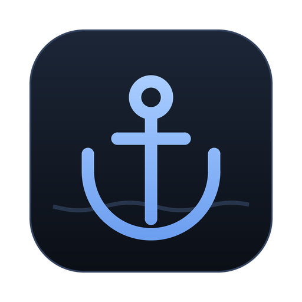
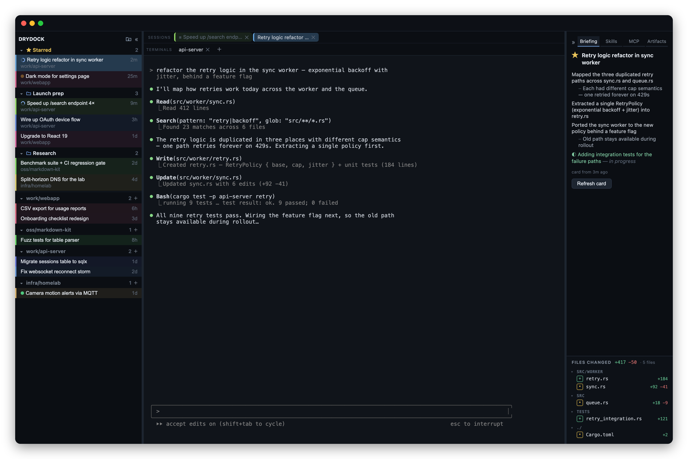
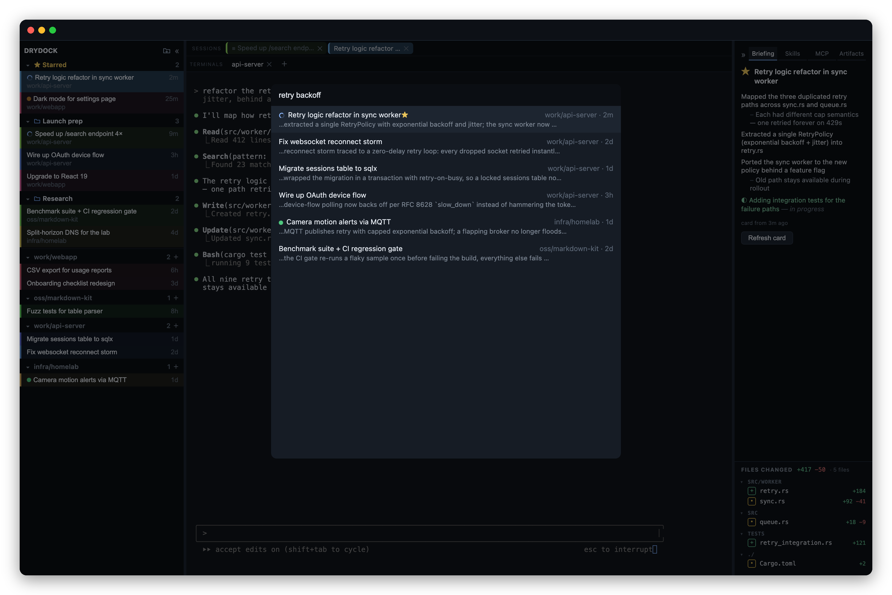
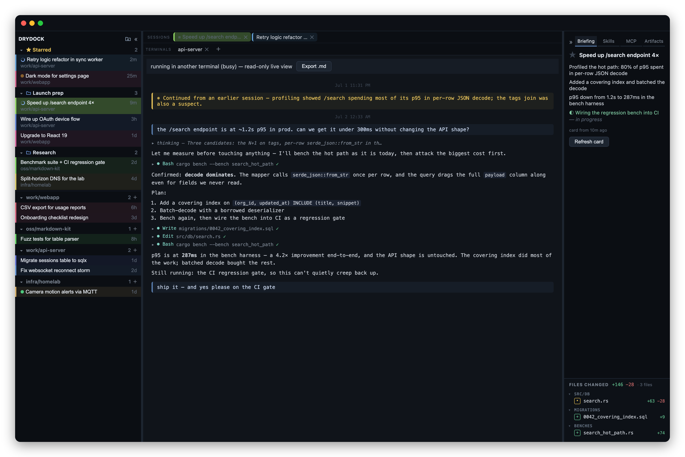
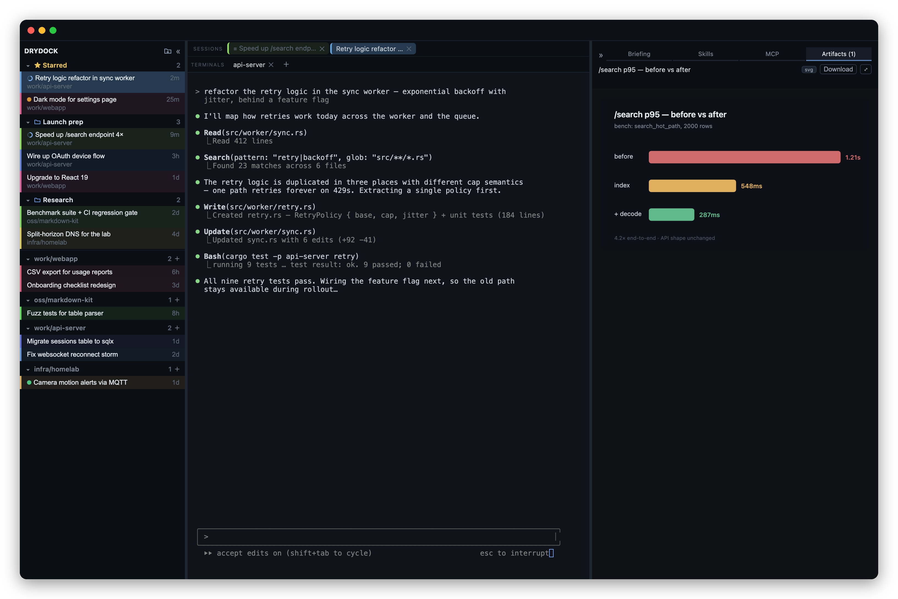

<div align="center">



# Drydock

**A home port for all your Claude Code sessions.**

Search your entire history, see what's running in *any* terminal,<br/>
and resume any session right where you left off — with an AI briefing of what happened.

[](#install)
[](https://v2.tauri.app)
[](https://claude.com/claude-code)
[](LICENSE)

<br/>



</div>

Claude Code writes every session to disk — but once you have dozens of them scattered across projects and terminal windows, they're easy to lose track of. Drydock indexes all of them into one native window: a **session radar** for what's live right now, **full-history search** for everything that came before, and a **real terminal** to pick any of it back up.

It never wraps the `claude` binary and never writes inside `~/.claude`. It reads your transcripts, hosts real terminals, and keeps a local index. Nothing leaves your machine.

## Highlights

- **Full-history search (⌘K)** — keyword *and* semantic search across every session you've ever run, computed locally with an on-device embedding model (English and Chinese). Filter with `proj:`, `starred:`, `live:`.
- **Cross-project session radar** — every session in a sidebar, grouped by project, with 🟢 busy / 🟡 needs-input indicators for anything running in *any* terminal — not just Drydock's own tabs.
- **One-click resume** — reopens `claude --resume` in the session's original working directory. A session that's already live somewhere else opens as a live read-only transcript instead.
- **Briefing cards** — an AI summary and milestone timeline for each session (generated through your own `claude` CLI), plus a **files-changed** panel with per-file `+/−` line stats. Summaries double as display titles, so cryptic first-lines become readable names.
- **Working folders** — drag sessions into folders that cut across projects (“Launch prep”, “Research”), or file them from the right-click menu. Starred sessions get a pinned section on top.
- **Semantic colors** — each session's accent color comes from an embedding of what it's *about*, so related work wears related colors across the sidebar and tabs.
- **Readable transcripts** — open any session as a rendered document (markdown, collapsible tool calls and thinking), flip between a live terminal and its transcript with ⌘⇧T, find in-session with ⌘F, export to markdown.
- **Artifacts** — sessions launched from Drydock can render HTML, SVG, or Markdown into a side panel via a built-in loopback MCP server. Previews are saved per session into a local gallery.
- **A real terminal** — xterm.js on a PTY with GPU rendering and full IME support (pinyin included). Notifications and a menu-bar tray flag any session waiting on your input.

## A quick tour

### Search everything you've ever done

⌘K searches your entire Claude Code history — every project, every session. Results fuse keyword matches with on-device semantic search, so “retry backoff” also finds the session where you called it “reconnect storm”.



### Every session is a readable document

Sessions open as rendered transcripts: user and assistant turns, collapsible tool calls and thinking, timestamps, compaction recaps. Live sessions tail in real time — read what a session is doing in another terminal without touching it. The briefing panel keeps the AI timeline and the session's file changes alongside.



### Sessions can show you things

Ask a session to render a chart, a diagram, or a mockup and it appears in the Artifacts panel — no browser round-trip. Drydock exposes a loopback MCP server to the sessions it launches; artifacts are kept in a per-session gallery you can reopen or save.



## How it works

```
~/.claude  (read-only)            Drydock (Rust + Tauri)
  projects/*/*.jsonl  ──watch──►  local SQLite mirror
  sessions/<pid>.json ──poll───►  (sessions · chunks · FTS · embeddings)
                                  PTY host · search · briefings
                                        │ Tauri IPC
                                  React UI: sidebar · ⌘K · tabs · briefing
```

Drydock is a **read-only mirror**. A file watcher tails your transcripts into a local SQLite database (full-text index + vector embeddings), and a short poll of Claude Code's live-session registry powers the radar. It hosts PTYs so tabs are real terminals, but it never intercepts or wraps the `claude` CLI. Delete the index anytime — it rebuilds itself from `~/.claude`.

## Install

**Requirements:** macOS (Apple Silicon or Intel), [Claude Code](https://claude.com/claude-code) on your `PATH`. To build: Rust (stable) and Node 18+.

```sh
git clone https://github.com/xd00099/drydock.git
cd drydock
npm install
npm run tauri build
```

The bundle lands in `target/release/bundle/macos/Drydock.app`. It's unsigned, so on first launch right-click the app → **Open**. For development, `npm run tauri dev`.

## Everyday use

| Shortcut | Action |
|---|---|
| ⌘K | Search all sessions |
| ⌘F | Find within the active session |
| ⌘⇧T | Toggle terminal ⇄ read-only transcript |
| ⌘T | New shell tab |
| ⌘W | Close the active tab |
| ⌘D | Star / unstar the active session |

Click a session in the sidebar to preview it (a single preview tab until you engage — typing or scrolling keeps it). Drag a session onto a folder — or onto empty space in the folder band — to organize; right-click for the same moves plus hide, delete, and transcript. Resuming an ended session reopens it in its original directory; a session live elsewhere opens read-only.

## Configuration

Drydock calls your own `claude` binary, so it inherits whatever backend you've configured — Anthropic, an OpenAI-compatible/LiteLLM proxy, or AWS Bedrock. An optional `settings.json` in `~/Library/Application Support/com.drydock.app/` tunes two things:

```json
{
  "card_model": "sonnet",
  "claude_env": { "ANTHROPIC_BASE_URL": "http://localhost:4000" }
}
```

- `card_model` — model used for briefing cards (default `sonnet`; set to `null` to use your CLI's default, e.g. on Bedrock/LiteLLM where the alias may not resolve).
- `claude_env` — environment variables injected into every process Drydock spawns. Handy when your endpoint is configured only in `~/.zshrc`, which non-interactive shells don't source.

Changes apply to new tabs and the next card without restarting.

## Data & privacy

Everything stays local. Drydock reads `~/.claude` (never writes to it), keeps its index under `~/Library/Application Support/com.drydock.app/`, and runs embeddings on-device. The only network calls are briefing cards, made through your own `claude` CLI to whatever backend you've configured. When Claude Code deletes a transcript under its retention policy, the session leaves Drydock too.

## Roadmap

- Hooks-based live status (replace the registry poll)
- Search-result card previews on hover
- Subagent (sidechain) transcript indexing
- Windows / Linux support

Contributions welcome — open an issue or a pull request.

## License

[MIT](LICENSE)
