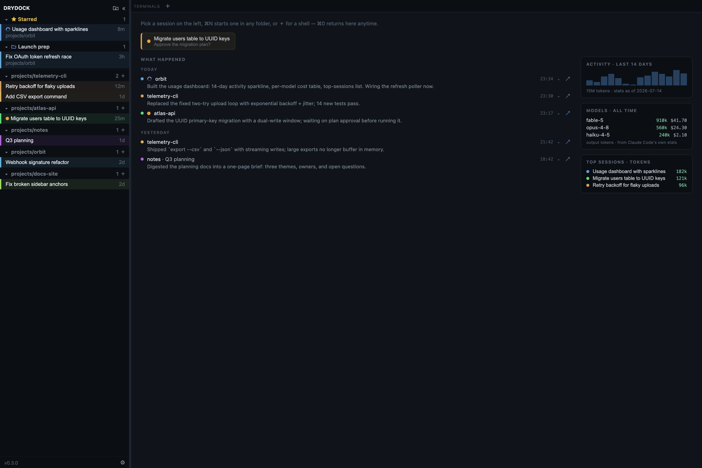
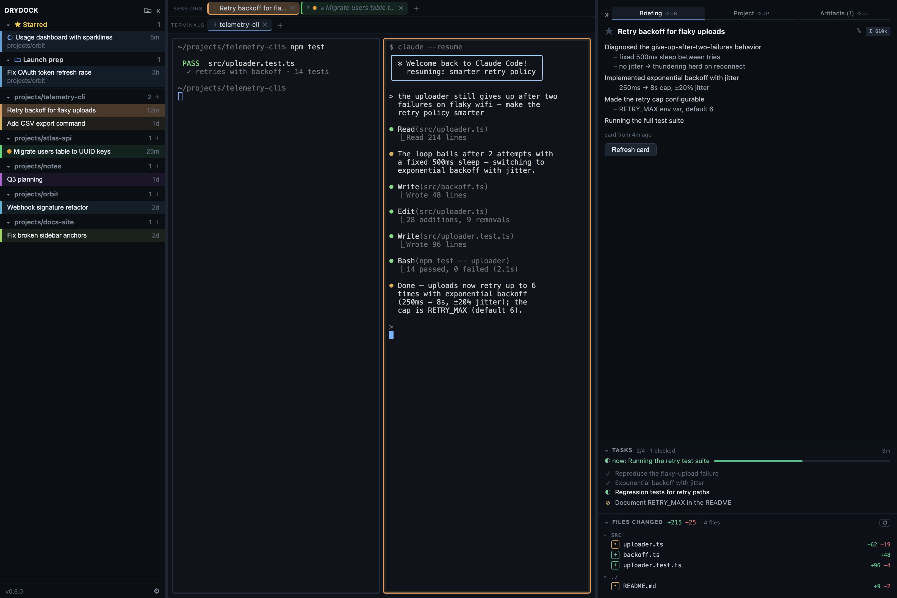
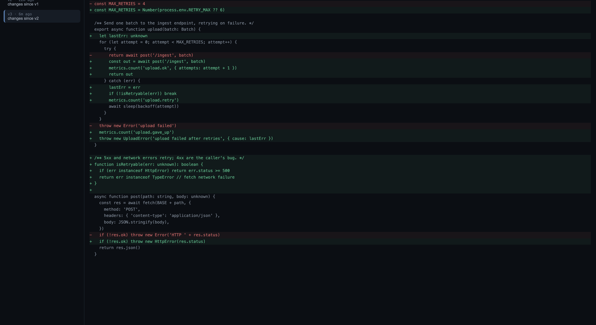
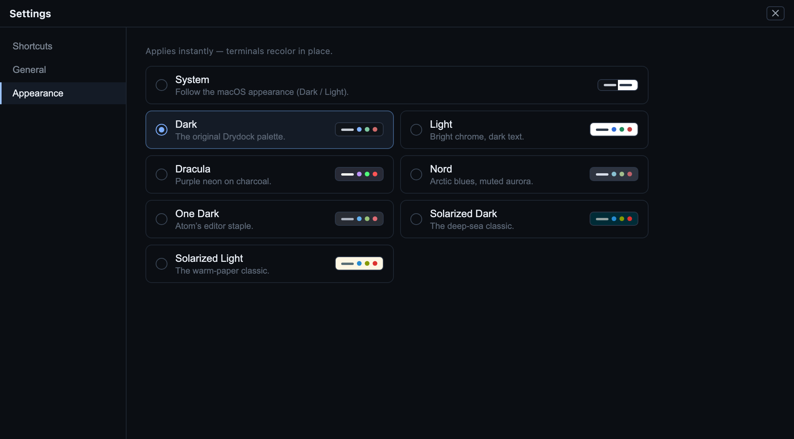

<div align="center">


# Drydock

**A home port for all your Claude Code sessions.**

Search your entire history, see what's running in *any* terminal,<br/>
and resume any session right where you left off — with an AI briefing of what happened.

[](#install)
[](https://v2.tauri.app)
[](https://claude.com/claude-code)
[](LICENSE)

<br/>


</div>

Claude Code writes every session to disk — but once you have dozens of them scattered across projects and terminal windows, they're easy to lose track of. Drydock indexes all of them into one native window: a **session radar** for what's live right now, **full-history search** for everything that came before, and a **real terminal** to pick any of it back up.

It never wraps the `claude` binary and — save an explicit right-click *Delete permanently* — never touches `~/.claude`. It reads your transcripts, hosts real terminals, and keeps a local index; the only thing that ever sends transcript content anywhere is the briefing card, made through your own `claude` CLI.

## Highlights

- **Full-history search (⌘K)** — keyword *and* semantic search across every session you've ever run, computed locally with an on-device embedding model (English and Chinese). Filter with `proj:`, `starred:`, `live:`.
- **Cross-project session radar** — every session in a sidebar, grouped by project, with busy / 🟢 idle indicators for anything running in *any* terminal — not just Drydock's own tabs — and a 🟡 needs-your-input flag on the sessions Drydock launched.
- **Home** — the launchpad is a work log, not a blank page: an AI recap of what each session actually did, grouped by day, with the sessions waiting on your input pinned on top and a usage column (14-day activity, per-model cost, top sessions) alongside.
- **One-click resume** — reopens `claude --resume` in the session's original working directory. A session that's already live somewhere else opens as a live read-only transcript — or **take it over**: Drydock names exactly what it will stop (pid, owning app, tty), asks, then resumes the session in its own tab.
- **Briefing cards** — an AI summary and milestone timeline for each session (generated through your own `claude` CLI), the session's live task board, and a **files-changed** panel with per-file `+/−` line stats. Summaries double as display titles, so cryptic first-lines become readable names.
- **File time machine** — browse Claude Code's per-edit checkpoints of every file the session touched: a version rail per file, before/after diffs, entirely read-only.
- **Split screen** — drag a tab onto the stage (or right-click a chip) to split it VS Code-style; panes wear their session's color, focus follows the pane (⌘⌥arrows), ⇧⌘⏎ zooms one to full stage.
- **Working folders** — drag sessions into folders that cut across projects ("Launch prep", "Research"), rename any session to whatever you call it in your head, and star the ones that matter — all stored in Drydock's index, never in `~/.claude`.
- **Semantic colors** — each session's accent color comes from an embedding of what it's *about*, so related work wears related colors across the sidebar, tabs, and split panes.
- **Readable transcripts** — open any session as a rendered document (markdown, collapsible tool calls and thinking, subagent transcripts), flip between a live terminal and its transcript with ⌘⇧T, find in-session with ⌘F, export to markdown.
- **Artifacts** — sessions launched from Drydock can render HTML, SVG, or Markdown into a side panel via a built-in loopback MCP server. Previews are saved per session into a local gallery.
- **Interactive review** — annotate a rendered artifact by clicking the element you mean (⌘I), send the notes back, and Claude applies them and re-renders. Plans get reviewed by pointing, not by describing.
- **Keyboard-first, your keys** — a new-session-in-any-folder dialog (⌘N, creates missing folders), panel and tab chords, and a Settings page (⌘,) where every binding is rebindable. Seven themes — Dark, Light, Dracula, Nord, One Dark, Solarized Dark/Light — or follow the system.
- **A real terminal** — xterm.js on a PTY with GPU rendering and full IME support (pinyin included). Notifications, a menu-bar tray, and a close-tab guard make sure muscle-memory ⌘W never kills a running turn.

## A quick tour

### Come back to a briefing, not a scrollback

Home is a work log of everything Claude did across every project — each session's recap grouped by day, expandable to its milestone timeline, with a ↗ jump straight into the session. Anything waiting on your input sits pinned at the top; the usage column keeps activity, per-model cost, and your heaviest sessions in view.



### Search everything you've ever done

⌘K searches your entire Claude Code history — every project, every session. Results fuse keyword matches with on-device semantic search, so "retry backoff" also finds the session where you called it "reconnect storm".


### Every session is a readable document

Sessions open as rendered transcripts: user and assistant turns, collapsible tool calls and thinking, subagent transcripts, timestamps. Live sessions tail in real time — read what a session is doing in another terminal without touching it, and if you want it, **Take over here** stops the terminal that owns it (it asks first) and resumes the session in Drydock.


### Sessions can show you things

Ask a session to render a chart, a diagram, or a mockup and it appears in the Artifacts panel — no browser round-trip. Hit ⌘I to annotate the render by clicking the element you mean; your notes go back to the session, which applies them and re-renders. Artifacts persist in a per-session gallery.


### Split the stage

Drag a tab chip onto the stage to split it — each pane wears its session's color, focus follows the pane, and ⇧⌘⏎ zooms one pane to the full stage and back.



### Rewind any file the session touched

The briefing panel's files-changed list opens into a time machine over Claude Code's per-edit checkpoints: pick a file, walk its versions, read the diff of each step. Entirely read-only — nothing gets restored behind your back.



### Make it yours

Every chord is rebindable with conflict detection (only ⌘1–9 stays fixed), and seven themes ship in the box — the embedded terminals recolor in place.



## How it works

```
~/.claude  (read-only)            Drydock (Rust + Tauri)
  projects/*/*.jsonl  ──watch──►  local SQLite mirror
  sessions/<pid>.json ──poll───►  (sessions · chunks · FTS · embeddings)
                                  PTY host · search · briefings
                                        │ Tauri IPC
                                  React UI: sidebar · ⌘K · tabs · briefing
```

Drydock is a **read-only mirror**. A file watcher tails your transcripts into a local SQLite database (full-text index + vector embeddings); a 2-second poll of Claude Code's live-session registry powers the busy/idle radar, and per-session hooks (injected only into tabs Drydock launches, via spawn-time flags) flag sessions waiting on your input. It hosts PTYs so tabs are real terminals, but it never intercepts or wraps the `claude` CLI. Delete the index anytime — sessions and search rebuild from `~/.claude`, and Drydock-side extras (stars, folders, renames) survive through a small backup file kept beside the database; only cached briefings regenerate.

## Install

**Requirements:** macOS on Apple Silicon (Intel: build from source), [Claude Code](https://claude.com/claude-code) on your `PATH`.

**Homebrew**

```sh
brew tap xd00099/tap
brew install --cask drydock
```

**Direct download** — grab the `.dmg` from the [latest release](https://github.com/xd00099/drydock/releases/latest).

Drydock isn't signed with an Apple Developer ID yet, so macOS quarantines the download and reports the app as **"damaged"** on first launch. It isn't — clear the quarantine flag and it opens normally:

```sh
xattr -dr com.apple.quarantine /Applications/Drydock.app
```

(or install with `brew install --cask drydock --no-quarantine`). Once running, Drydock checks GitHub Releases twice a day (or on demand — click the version in the sidebar footer) and shows an **Update** button that downloads and installs the new version in place; your open tabs are restored after the restart.

**Build from source** — needs Rust (stable) and Node 18+:

```sh
git clone https://github.com/xd00099/drydock.git
cd drydock
npm install
npm run tauri build
```

The bundle lands in `target/release/bundle/macos/Drydock.app`. For development, `npm run tauri dev`.

## Everyday use

| Shortcut | Action |
|---|---|
| ⌘K | Search all sessions |
| ⌘0 | Go Home |
| ⌘N | New claude session in any folder (created if missing) |
| ⌘F | Find within the active session |
| ⌘⇧T | Toggle terminal ⇄ read-only transcript |
| ⌘T | New shell tab (inherits the active tab's directory) |
| ⌘W | Close the active tab (asks first if the session is live) |
| ⌘D | Star / unstar the active session |
| ⌘B / ⌘J | Toggle sidebar / briefing panel |
| ⌘⇧B / ⌘⇧P / ⌘⇧J | Jump to the Briefing / Project / Artifacts tab |
| ⌘1–9 · ⌘⇧[ ] | Switch tabs |
| ⌘⌥←→↑↓ · ⇧⌘⏎ | Move focus between split panes · zoom a pane |
| ⌘, | Settings — rebind any of these (⌘1–9 stays fixed), pick a theme |

Click a session in the sidebar to preview it (a single preview tab until you engage — typing in it keeps it). Drag a session onto a folder — or onto empty space in the folder band — to organize; right-click for the same moves plus rename, hide, delete, and transcript. Resuming an ended session reopens it in its original directory; a session live elsewhere opens read-only — or right-click → **Take over here** to stop the terminal that owns it and resume it in Drydock (it asks first).

## Configuration

Drydock calls your own `claude` binary, so it inherits whatever backend you've configured — Anthropic, an OpenAI-compatible/LiteLLM proxy, or AWS Bedrock. An optional `settings.json` in `~/Library/Application Support/com.drydock.app/` tunes five things:

```json
{
  "card_model": "sonnet",
  "claude_env": { "ANTHROPIC_BASE_URL": "http://localhost:4000" },
  "artifacts_enabled": true,
  "mcp_disabled": ["github"],
  "editor_cmd": "code"
}
```

- `card_model` — model used for briefing cards (default `sonnet`; set to `null` to use your CLI's default, e.g. on Bedrock/LiteLLM where the alias may not resolve).
- `claude_env` — environment variables injected into every process Drydock spawns. Handy when your endpoint is configured only in `~/.zshrc`, which non-interactive shells don't source.
- `artifacts_enabled` — inject the artifact-preview MCP server into sessions Drydock launches (default `true`).
- `mcp_disabled` — your MCP servers to hide from Drydock-launched sessions; also toggleable per server in the Project tab.
- `editor_cmd` — CLI used by "open in editor" in the files-changed list (e.g. `code`; default: the system opener).

`card_model` and `claude_env` changes reach the next briefing card immediately; terminal tabs pick up `claude_env` on the next Drydock restart.

## Data & privacy

Everything stays local. Drydock reads `~/.claude` and never writes to it — with one explicit exception: right-click → *Delete permanently* removes that session's transcript, at your request. Its own index lives under `~/Library/Application Support/com.drydock.app/`, and embeddings run on-device. Transcript content only ever leaves through briefing cards, generated automatically via your own `claude` CLI to whatever backend you've configured. Everything else on the wire is content-free: a twice-daily GitHub Releases version check, a one-time download of the ~110 MB embedding model on first launch, the MCP health check (your own `claude mcp list`, which contacts the servers you configured), and whatever remote images or libraries a rendered HTML artifact references — the preview is sandboxed, but it loads resources like any web page. When Claude Code deletes a transcript under its retention policy, the session leaves Drydock too.

## Roadmap

- Hooks-based live status for sessions in other terminals (Drydock-launched tabs already use hooks; the registry poll remains for external ones)
- Search-result card previews on hover
- Windows / Linux support

Contributions welcome — open an issue or a pull request.

## License

[MIT](LICENSE)
